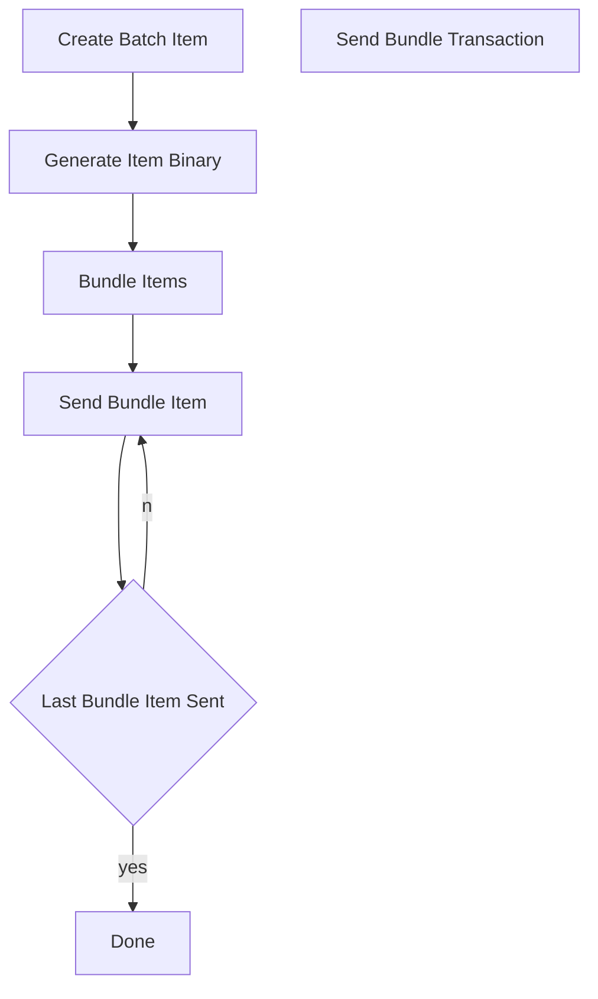
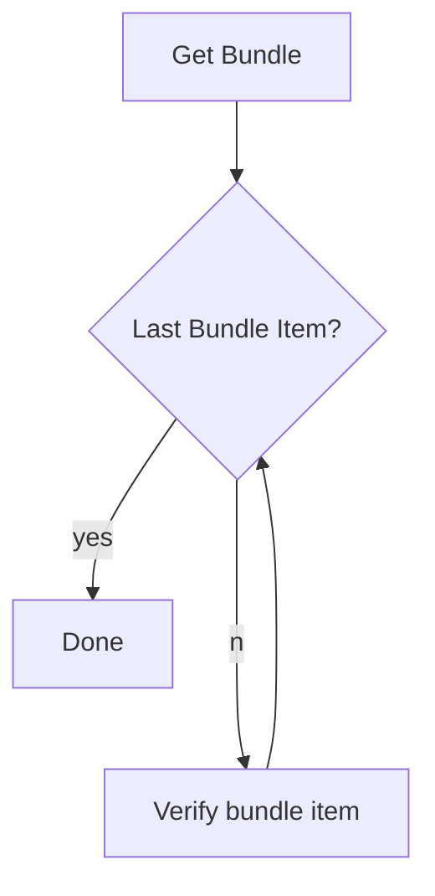

# gondlr
*pronounced gondola -- a light flat-bottomed boat used on Venetian canals, having a high point at each end and worked by 
one oar at the stern.*

A golang implementation of the Bundlr SDK

## TODO:
The current todo items are just a brain dump as I research, the naming of them may be incorrect!

- [ ] Create and sign a bundle item
- [ ] Generate Item Binary
- [ ] Bundle items
- [ ] Send Bundle Item(s)
- [ ] Get/Decode Bundle
- [ ] Verify Bundle Item

## Brain dump / Understanding

I am using [goar](https://github.com/everFinance/goar) as a reference currently as the [bundlr](bundlr.network) 
documentation is lacking detail at the time of writing this.

### Supported Signers

> we have a map of number => Signer
which contains all metadata required
there's a field on a Bundlr tx which describes the sig type
1 = Arweave specific
2 = Ed25519 (Solana, Cardano etc etc)
3 = Ethereum specific (so all ETH compat like Polygon etc etc)
4 = TBC 😝